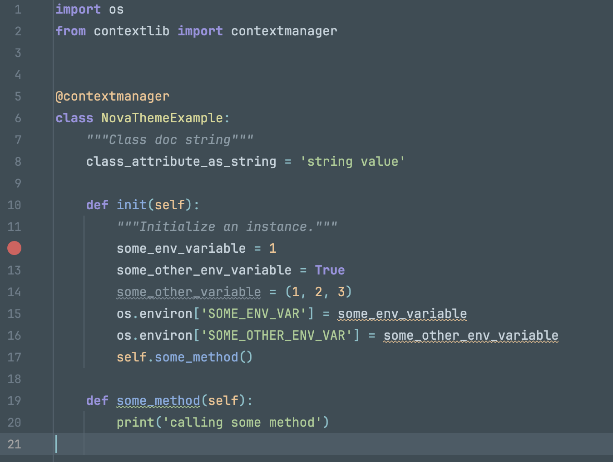

# Nova Color Theme for IntelliJ IDEA

## Description
This is a color theme for IntelliJ IDEA IDE based on Nova Color Theme from Trevor D. Miller
([https://trevordmiller.com/projects/nova](https://trevordmiller.com/projects/nova)). Theme is 
applied only to Editor window due to limitation of IDE customization.

## Screenshots

## Compatibility
The theme file is compatible with IntelliJ IDEA 2018.2.4 and above. It was not tested on 
previous versions, so please use it on your own risk.

## Installation
1. Open `Preferences` in main menu of IntelliJ IDEA. Choose `Editor`->`Color Scheme`.
2. Press gear button at the right, choose `Import Scheme...` from dropdown menu.

3. Choose downloaded `Nova.icls` file and ensure it is selected in dropdown menu.

4. Click `Apply` button at the right-bottom.
